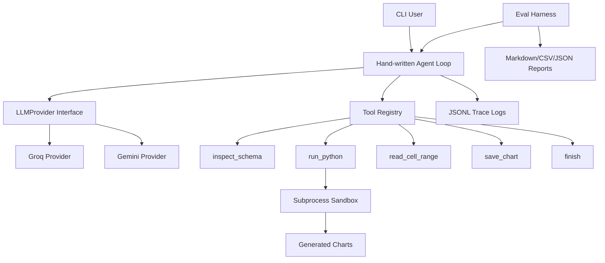

# DataAgent

CLI-based AI data analyst agent for CSV/Excel files.

It takes a natural-language question, inspects the dataset, calls tools, runs pandas/matplotlib code in a subprocess sandbox, recovers from errors, and writes a final answer with trace logs and chart outputs.

---

## Project Structure

```text
assets/
  screenshots/          # README screenshots / demo captures

data/
  raw/                  # input datasets used by the CLI and eval harness
  processed/            # optional cleaned/derived datasets

models/                 # reserved for local/Ollama model metadata or future artifacts

outputs/
  figures/              # generated charts from agent/eval runs
  reports/              # eval benchmark reports: markdown, CSV, JSON

src/
  dataagent/            # main package: agent loop, providers, sandbox, tools
  eval/                 # eval cases, property assertions, benchmark harness

runs/                   # JSONL trace logs per run, ignored by git
```

---

## Quick Start

```bash
cp .env.example .env
# add your GROQ_API_KEY to .env
uv sync
uv run python -m dataagent data/raw/titanic.csv
```

Example question:

```text
What is the mean age of passengers and what percentage survived?
```

---

## Real Eval / Benchmark Harness

Run the same eval questions against one or more providers:

```bash
uv run python -m eval.harness --providers groq
```

Smoke test only the first two cases:

```bash
uv run python -m eval.harness --providers groq --limit 2
```

Outputs are written to:

```text
outputs/reports/eval_results.md
outputs/reports/eval_results.csv
outputs/reports/eval_results.json
```

Charts generated during evals are written to:

```text
outputs/figures/
```

Trace logs are written to:

```text
runs/<run_id>/trace.jsonl
```

Each result records:

| Metric | Meaning |
|---|---|
| pass/fail | Property-based assertion result |
| latency_ms | End-to-end case latency |
| iterations | Number of model calls/tool-loop turns |
| provider/model | Provider and model used |
| answer | Final agent answer excerpt |
| error | Dataset/API/provider failure, if any |

---

## Architecture



---

## Tool Catalogue

| Tool | Purpose |
|---|---|
| `inspect_schema` | Shape, dtypes, head, null counts, and summary stats |
| `run_python` | Executes pandas/matplotlib code in a subprocess sandbox |
| `read_cell_range` | Reads a specific CSV/Excel slice for messy files |
| `save_chart` | Saves the current matplotlib figure |
| `finish` | Stop condition with final written answer |

---

## Sandbox Threat Model

The sandbox is designed for a local trusted-user portfolio demo. It reduces accidental damage but is **not** a production-grade isolation boundary.

Mitigations included:

- subprocess execution
- timeout cap
- POSIX memory limit where available
- obvious shell/network/import escape blocklist
- chart output isolated to `outputs/figures/`

Not guaranteed:

- kernel-level network isolation
- protection from every Python escape trick
- safe execution of malicious code from untrusted users

---

## Current Priority Completed

This version focuses on **Priority 1: real eval/benchmark harness**.

Implemented now:

- runnable eval CLI
- real markdown/CSV/JSON result outputs
- latency measurement
- provider/model tracking
- iteration/model-call counting
- missing-key and missing-dataset error reporting
- clean project structure matching the `assets / data / models / outputs / src` style
