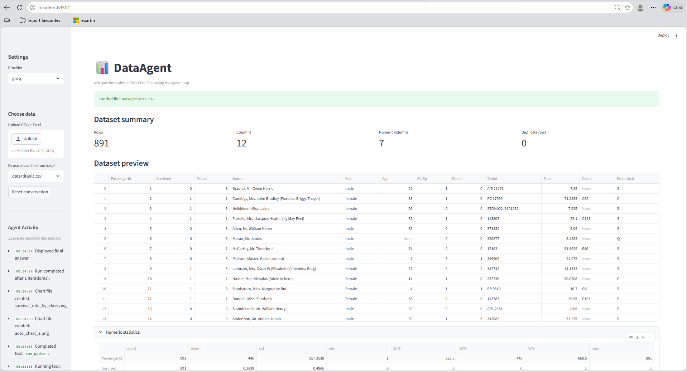
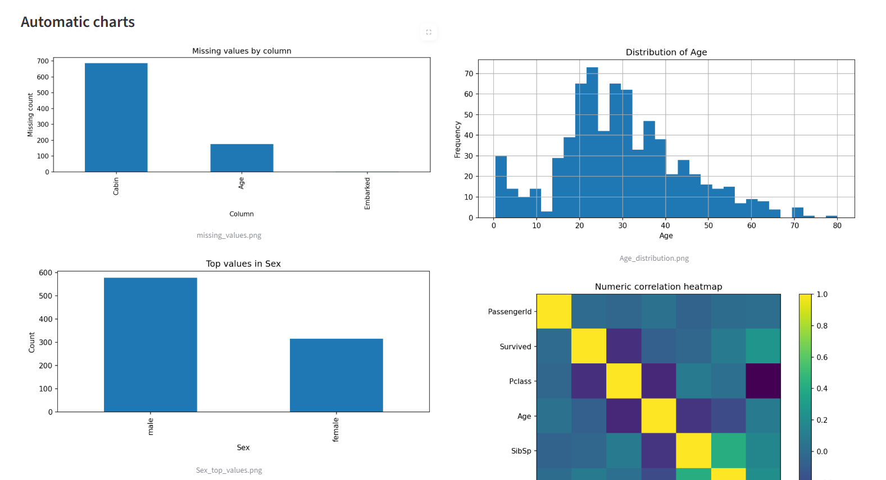
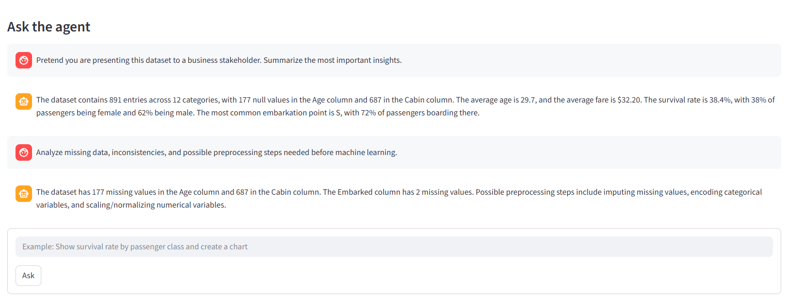
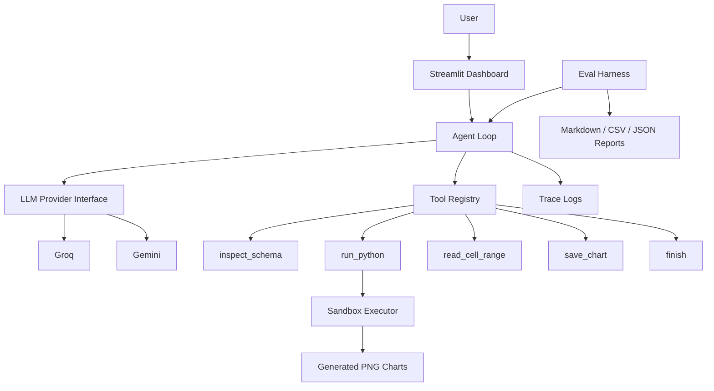

# AI Data Analysis Agent

Autonomous LLM-powered data analysis agent for CSV and Excel datasets.

The system can:
- inspect dataset schemas
- execute sandboxed Python analysis
- generate matplotlib charts
- perform exploratory data analysis (EDA)
- produce structured written insights
- log tool execution traces
- benchmark providers with an eval harness

Built using:
- Python
- Streamlit
- Groq
- Gemini
- Pandas
- Matplotlib

---

# Features

- Autonomous agent loop
- Tool-calling architecture
- Sandboxed Python execution
- Automatic chart generation
- Streamlit dashboard UI
- Live agent activity feed
- Trace logging
- Eval/benchmark harness
- Multi-provider support (Groq/Gemini)
- Markdown/CSV/JSON report export

---

# Demo

See:

```text
assets/demo/demo.mp4
```

---

# Screenshots

## Dashboard



---

## Chart Generation



---

## Analysis Output



---

# Project Structure

```text
assets/
  demo/                 # demo video/gifs
  screenshots/          # README screenshots

data/
  raw/                  # input datasets
  processed/            # optional cleaned datasets

models/                 # reserved for future local model artifacts

outputs/
  figures/              # generated charts
  reports/              # markdown/json/csv benchmark reports

src/
  dataagent/
    providers/          # Groq/Gemini integrations
    sandbox/            # subprocess sandbox executor
    tools/              # tool registry + tools
    ui.py               # Streamlit dashboard
    agent.py            # agent orchestration loop

  eval/
    cases/              # benchmark datasets/prompts
    assertions.py       # eval assertions
    harness.py          # evaluation runner

runs/
  <run_id>/trace.jsonl  # tool execution traces
```

---

# Quick Start

## 1. Create `.env`

```env
GROQ_API_KEY=your_key_here
GEMINI_API_KEY=your_key_here
```

---

## 2. Install dependencies

Using uv:

```bash
uv sync
```

Or using pip:

```bash
pip install -r requirements.txt
```

---

## 3. Launch the Streamlit UI

```bash
python -m streamlit run src/dataagent/ui.py
```

---

# Example Prompts

```text
Perform a complete exploratory data analysis of this dataset.
```

```text
Generate a correlation heatmap and explain the strongest relationships.
```

```text
Analyze missing values and summarize potential preprocessing steps.
```

```text
Identify the most important predictors of survival.
```

---

# Architecture



---

# Tool Catalogue

| Tool | Purpose |
|---|---|
| `inspect_schema` | Dataset shape, dtypes, null counts, statistics |
| `run_python` | Executes pandas/matplotlib analysis in sandbox |
| `read_cell_range` | Reads partial CSV/Excel slices |
| `save_chart` | Persists matplotlib figures |
| `finish` | Final structured response output |

---

# Sandbox Threat Model

The sandbox is designed for:
- local trusted-user workflows
- portfolio demonstrations
- safe-ish subprocess execution

Included mitigations:
- subprocess execution isolation
- timeout limits
- restricted imports
- blocked shell/network operations
- isolated chart output directories

Not guaranteed:
- production-grade isolation
- protection against all Python escape vectors
- secure execution of malicious user code

---

# Eval / Benchmark Harness

Run evaluation benchmarks:

```bash
python -m eval.harness --providers groq
```

Limit benchmark size:

```bash
python -m eval.harness --providers groq --limit 2
```

Generated outputs:

```text
outputs/reports/
outputs/figures/
runs/<run_id>/trace.jsonl
```

Tracked metrics:
- pass/fail assertions
- latency
- iteration count
- provider/model usage
- answer quality
- execution errors

---

# Current Status

Implemented:
- Streamlit dashboard
- Autonomous agent loop
- Tool calling
- Python sandbox execution
- Automatic chart generation
- Activity feed
- Eval harness
- Report export
- Multi-provider support

Planned future improvements:
- SQL database support
- Vector database integration
- Local LLM support
- Persistent memory
- Multi-agent workflows
- Async task execution
- Web data connectors

---

# Tech Stack

- Python
- Streamlit
- Pandas
- Matplotlib
- FastAPI
- Groq API
- Gemini API
- uv
- JSONL tracing

---

# License

MIT